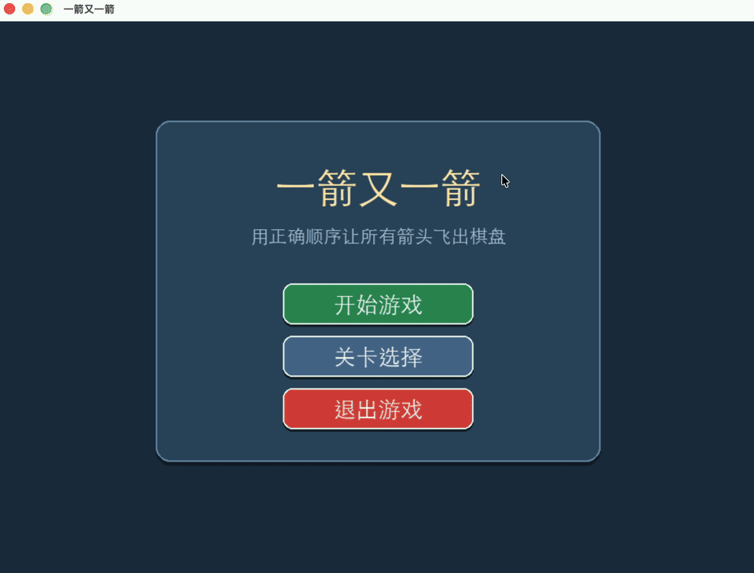

# 一箭又一箭

“一箭又一箭”是一款使用 Python 与 Pygame 开发的单机益智小游戏。玩家需要判断箭头前方是否畅通，选择没有被其他箭头阻挡的箭头，使其飞出棋盘；清除全部箭头即可通关。

项目包含 6 个难度递增的关卡、提示与自动求解、计分和星级评价、音效开关、关卡选择及失败重开等功能，并提供 macOS 打包配置。

## 游戏演示



上方演示展示了主菜单、第 1 关的状态栏与操作区、阻挡箭头的碰撞反馈、提示高亮、自动求解、按正确顺序消除箭头、三星通关结算，以及返回主菜单的导航流程。

## 开发环境

| 项目 | 版本 / 环境 |
| --- | --- |
| 操作系统 | macOS（Apple Silicon / arm64） |
| Python | 3.13.15（兼容 Python 3.13） |
| Pygame | 2.6.1 |
| PyInstaller | 6.22.3 |

## 快速开始

### 直接运行源码

运行环境为 Python 3.13 和 Pygame 2.6.1。进入项目根目录后创建虚拟环境并安装锁定版本的依赖：

```bash
python3 -m venv .venv
./.venv/bin/python -m pip install -r requirements.txt
./.venv/bin/python main.py
```

也可使用已激活的任意虚拟环境：

```bash
python -m pip install -r requirements.txt
python main.py
```

### 构建 macOS 打包版本

仓库仅保存源码和 PyInstaller 配置，未提交 `dist/` 目录中的构建产物。安装 PyInstaller 后，在项目根目录执行：

```bash
./.venv/bin/python -m pip install pyinstaller==6.22.3
./.venv/bin/python -m PyInstaller --noconfirm --clean 一箭又一箭.spec
```

构建完成后，macOS 应用程序位于：

```text
dist/一箭又一箭.app
```

`build/` 和 `dist/` 均为可重新生成的构建目录，已由 `.gitignore` 排除，不属于仓库缺失文件。

## 游戏规则

- 点击朝向路径上没有其他未消除箭头的箭头，箭头会沿其指向飞出棋盘。
- 若前方有箭头，当前箭头不能飞出，会显示短暂的红色晃动，并扣除一次失误机会。
- 清除本关全部箭头即可进入结算页；完成当前关后解锁下一关。
- 每关可使用最多 3 次提示；提示会高亮一支当前可飞出的箭头。
- 点击“自动求解”后，程序会使用内置 DFS 求解器演示一条合法清关顺序。
- 重新开始会恢复该关的初始箭头、分数、计时、提示次数和失误次数。

## 游戏操作

| 操作 | 说明 |
| --- | --- |
| 鼠标左键点击箭头 | 选择箭头；前方无阻挡时箭头飞出棋盘，否则扣除一次失误机会。 |
| 点击“提示” | 高亮一支当前可安全飞出的箭头；每关最多 3 次。 |
| 点击“自动求解” | 演示一条合法的完整通关顺序。 |
| 点击“重新开始” | 重新开始当前关卡。 |
| 点击“返回主菜单”或按 `Esc` | 返回主菜单；会弹出确认提示以避免误操作。 |
| 点击“音效：开 / 关” | 切换音效状态。 |

## 计分与星级

每消除一支箭头获得 100 分；点击被阻挡的箭头扣 30 分，分数最低为 0。结算星级规则如下：

| 星级 | 分数要求 | 用时要求 |
| --- | --- | --- |
| 三星 | 不低于理论满分的 90% | 不超过 30 秒 |
| 二星 | 不低于理论满分的 60% | 不超过 60 秒 |
| 一星 | 未达到以上条件 | 无额外要求 |

## 项目结构

```text
.
├── main.py                 # 程序入口，并导出核心逻辑以兼容测试
├── game_runner.py          # Pygame 事件循环、页面状态和交互编排
├── config.py               # 棋盘、界面、计分和关卡配置
├── game_logic.py           # 阻挡判断、提示选择、DFS 自动求解和星级计算
├── rendering.py            # 字体、棋盘、箭头、按钮和弹窗绘制
├── audio.py                # 本地音效加载与降级处理
├── 一箭又一箭.spec          # PyInstaller 的 macOS 打包配置
├── game_demo.gif           # README 使用的游戏流程演示动图
├── assets/sounds/          # 音效资源及来源说明
├── assets/screenshots/     # 补充使用的静态游戏截图
├── tests/
│   ├── test_game_logic.py  # 19 项纯逻辑自动化测试
│   └── TEST_RECORD_TEMPLATE.md  # 人工测试记录表
├── docs/项目报告.md         # 作业提交用项目报告
└── requirements.txt         # 运行时 Python 依赖
```

## 测试

运行全部自动化测试：

```bash
./.venv/bin/python -m unittest discover -s tests -v
```

当前测试覆盖路径阻挡判断、边界箭头、关卡可解性、重开深拷贝、DFS 求解保护、提示选择和星级计算等核心逻辑。人工试玩项请按 [`tests/TEST_RECORD_TEMPLATE.md`](tests/TEST_RECORD_TEMPLATE.md) 记录。

## 资源与许可

游戏音效的文件来源与许可信息见 [`assets/sounds/SOURCES.md`](assets/sounds/SOURCES.md) 和 [`assets/sounds/LICENSE-KENNEY-CC0.txt`](assets/sounds/LICENSE-KENNEY-CC0.txt)。
